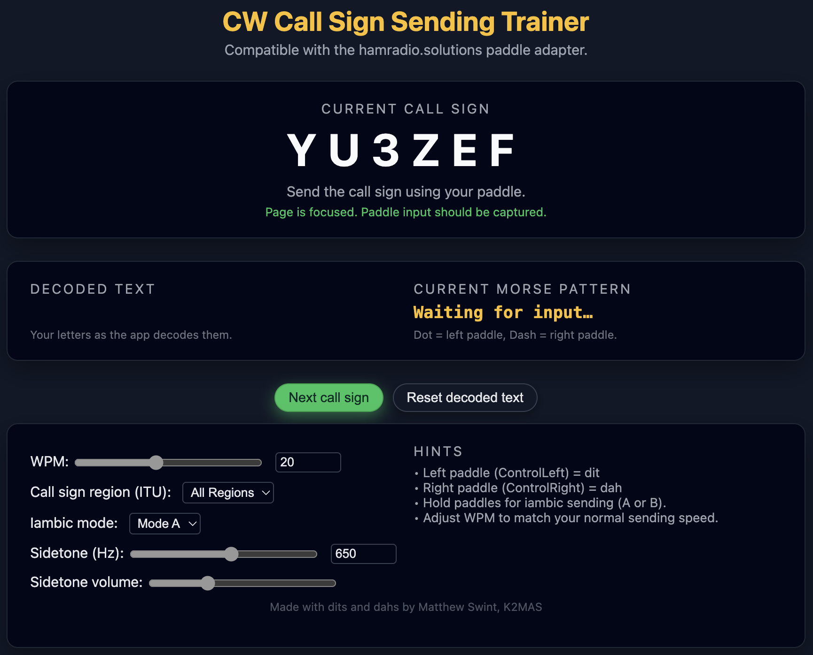

# CW Call Sign Trainer
Simple CW Call Sign Trainer using JavaScript. Download the HTML file, run it locally in your browser.

### Version history
0.11 alpha
- Added ability to flip paddle assignment to accommodate left-handed users.
- Added toggle to switch between light and dark themes, or to set automatically to match your system's theme.

  0.11 known issues
  - Iambic Mode B is broken. 

0.10 alpha
- Added support for generating AA - AL 2x2 and 2x1 U.S. calls properly.
- Customized settings now persist between visits. Your settings will load automatically the next time you load the app. 

0.9 alpha
- Added ability to reset attempt by sending EEEE (less helpful at slower WPM; this issue will be fixed in a future release).
- Added keyboard functionality for keyboards which do not have both a left and right Control key. You may now use [ and ] keys to send dits and dahs, respectively.
- Minor UI improvements.

0.8 alpha
- Extensive edits to call sign generator to get even closer to realistic call signs.
- Added "U.S. Calls Only" option in Call Region selector.

0.7 alpha
- Even more realistic call sign generation for ITU regions.
- Added config option to select ITU region to practice.

0.6 alpha
- Call signs should be more realistic and should only contain valid amateur service prefixes from ITU regions 1, 2, and 3.
- Support for ? and / character decoding (future feature requirement).

0.5 alpha
- Adjusted GUI.
- Zeros in call signs now show as Ø to remove ambiguity.
- Added sidetone frequency adjustment, to allow for better user customization.

0.4 alpha
- Adjusted GUI.
- Added helper text to sections.

0.3 alpha
- Adjusted GUI.

0.2 alpha
- Added sidetone generator.
- Added configuration options; WPM, sidetone volume, iambic keyer modes A and B settings.
- Adjusted GUI.

0.1 alpha
- Basic framework of the app.
- Accepts input from hamradio.solutions USB paddle interface as dits and dahs.
- Validates decoded input against test call.
